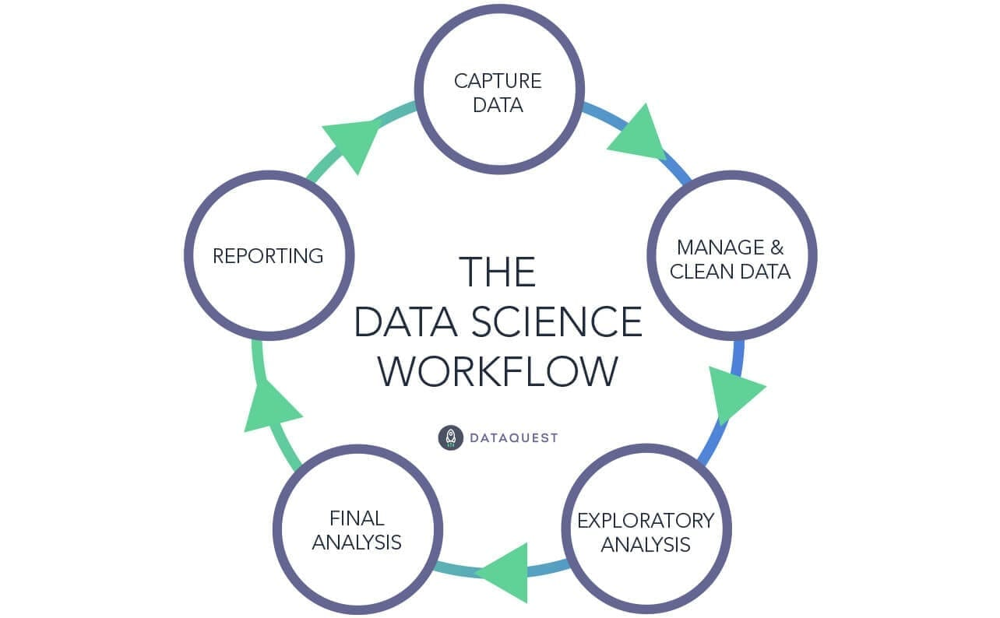

```{r setup, include=FALSE}
knitr::opts_chunk$set(echo = FALSE)
```

## Introduction

Hello!

-   5th year grad student in Political Science

-   MA in economics from CSULB

-   My research focuses on how money influences politics

-   I love data science!

-   I'll be working with you all year

## Boot Camp Outline

The goal of this boot camp is to introduce you to some of the basic principles of working with data and coding

-   How to download data

-   How to manipulate data

-   How to visualize data

I want to get you prepared to start your first quantitative course in the MPP program!

## This is a "Hands-on" Boot Camp

I want this to be more of an "Intro to Data Analysis with Some Code" instead of an "Intro to Coding" boot camp

-   I use R, but your quant instructor uses Python ...

-   Both languages are great for data science

-   I'll try to cover the very basics of R, which you will see are very similar to Python

## What's the Big Deal About Quant Methods?

-   They let us produce good answers to important questions:

    Easier questions:

1.  What states spend the most money on healthcare?
2.  What percentage of Republicans voted for Biden?

Harder questions:

1.  Does healthcare spending increase health outcomes?
2.  Do job training programs reduce unemployment?

## Working with Data is a Process

{width="75%"}

## Examples of Clean Data

```{r comment = ""}
head(mtcars)
```

1.  What does each row describe?
2.  Can you tell what the values in each column represent?

## Examples of Clean Data

```{r comment = "", message = FALSE}
data("Grunfeld", package = "plm")

library(tidyverse)
Grunfeld <- 
  Grunfeld %>%
  filter(year > 1952)

head(Grunfeld)
```

1.  What does each row describe?
2.  Can you tell what the values in each column represent?

## Examples of Messy Data

```{r, message = FALSE}
x <- rnorm(100, 4, 1.5)
y <- rbeta(100, 4, 3)
z <- rep(seq(from = 0, to = 1, by = 1), 50)

messy.matrix <- cbind(x, y, z)

head(messy.matrix)
```

1.  What does each row describe?
2.  Can you tell what the values in each column represent?

## Examples of Messy Data

```{r message = FALSE, comment = ""}
messy.df <- data.frame(x, y, z)

messy.df <- 
  messy.df %>%
  rename(CPO1976 = x,
         DCO9679 = y) %>%
  mutate(z = ifelse(z == 0, -999, z),
         t = round(CPO1976, digits = 0),
         t = as.character(t),
         t = str_replace(t, "5", " "))

head(messy.df)
```

1.  What does each row describe?
2.  Can you tell what the values in each column represent?

## Messy Data is Bad

-   Data should be meaningful (or it's not useful)

-   We need to be able to understand what the data tells us when we look at it

    -   What do the rows describe?
    -   What does each value mean?

## Exploratory Analysis

-   Once we understand our data we can explore it

-   Let's use an example

    -   Suppose we want to know about what predicts a car's miles per gallon in the city

    -   To explore this question, we'll use data on vehicle mpg:

```{r comment = ""}
head(mpg)
```

## Exploratory Analysis

-   How many different manufacturers do we have in our data?

    -   `r n_distinct(mpg$manufacturer)`

-   What are the oldest and youngest cars in our data?

    -   `r range(mpg$year)`

## Exploratory Analysis

-   What are the average city and highway MPG ratings?

```{r comment = ""}
mpg %>%
  select(cty, hwy) %>%
  summary()
```

## Exploratory Analysis

```{r message = FALSE}
ggplot(data = mpg, aes(x = cty)) +
  geom_histogram()
```

## Exploratory Analysis

```{r message = FALSE}
ggplot(data = mpg, aes(x = displ, y = cty)) +
  geom_point()
```

## Exploratory Analysis

```{r message = FALSE}
ggplot(data = mpg, aes(x = displ, y = cty, color = class)) +
  geom_point()
```

## Modeling

-   In the modeling stage we estimate formal relationships between variables

-   We can also make predictions about future data

```{r message = FALSE}
ggplot(data = mpg, aes(x = displ, y = cty)) +
  geom_point() +
  geom_smooth()
```

## Boot Camp Learning Objectives

If you give an honest effort to solve each practice problem, I promise that you will be able to do the follow at the end of the workshop:

1.  Understand the principles of tidy data

2.  Load a data set in R and clean it for analysis

3.  Summarize and visualize data
